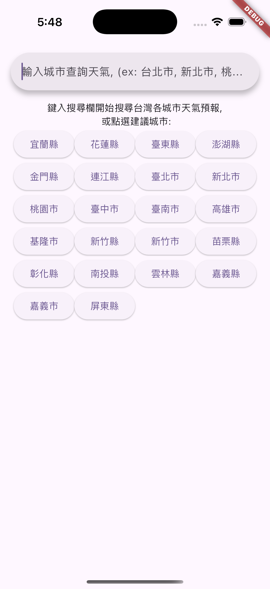
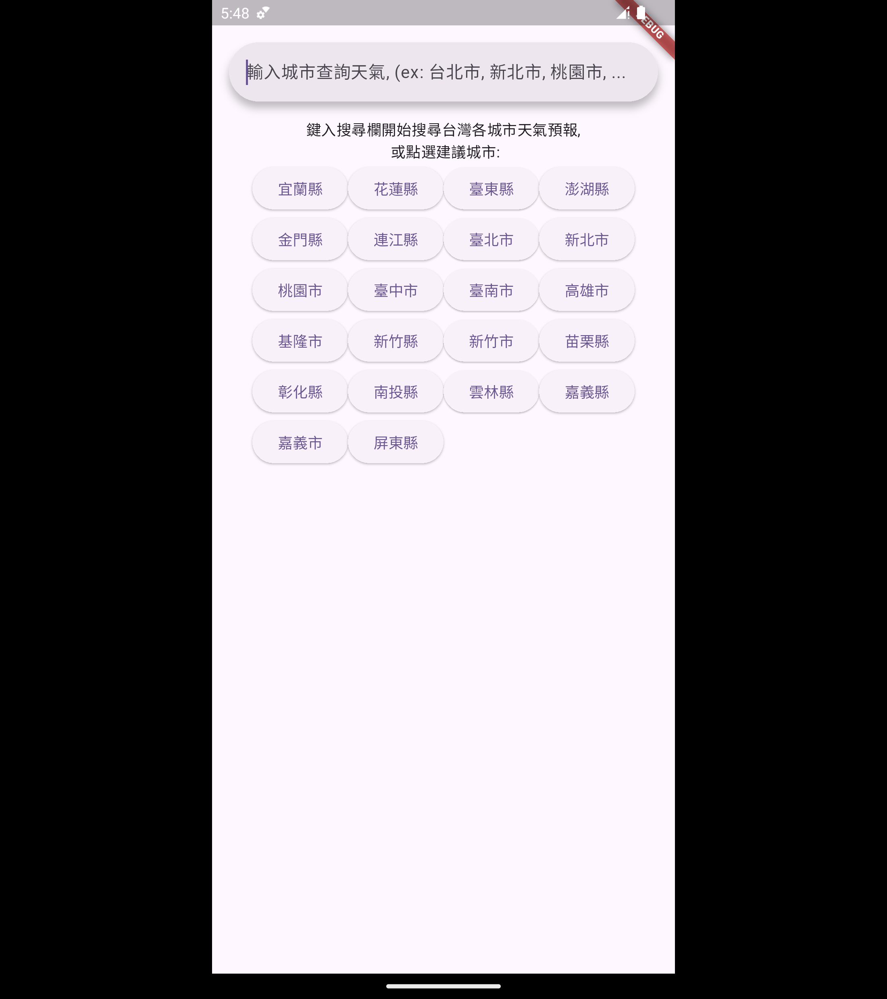
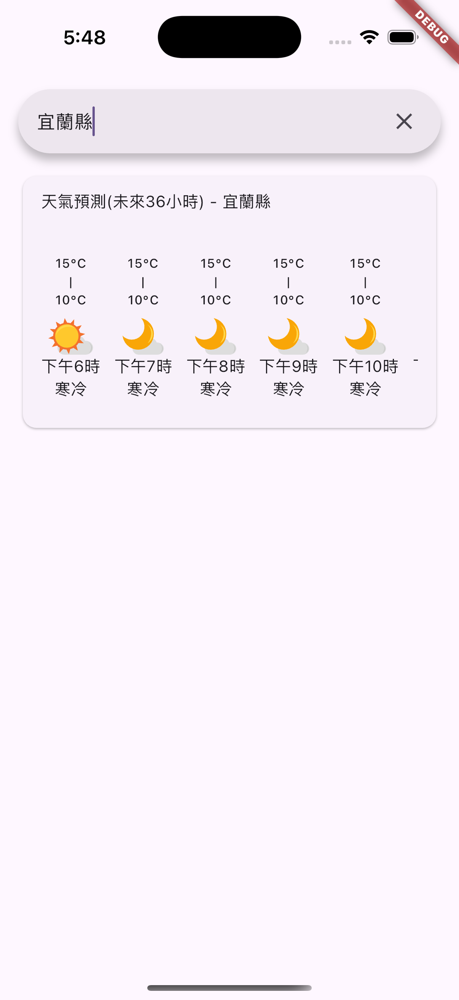
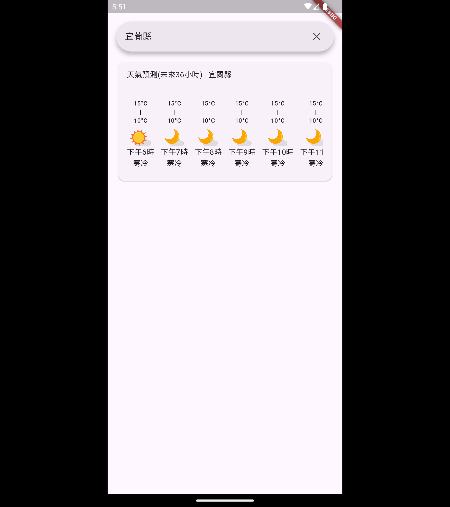

# the_weather_flutter

A demo app with [中央氣象屬開放API](https://opendata.cwa.gov.tw/dist/opendata-swagger.html)

ios|android
-|-
|
|

## Getting Started

Setup project with Makefile:

```
make setup
```

or manually run following commands:

```
cp .env.example .env
dart run build_runner build
```

Update your weather api key in `.env`

```
WEATHER_API_KEY=<YOUR_API_KEY>
```


Running app on emulator:
```
flutter run
```
